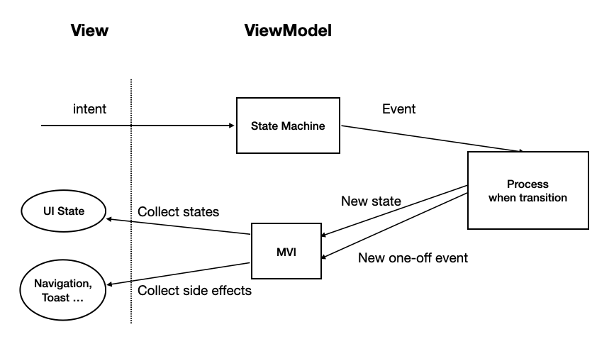

<h1 align="center">Demo CurrencyInfo List</h1> 

  
A demo currency info list app using Hilt and StateMachine based on modern Android tech-stacks and MVI architecture with Uncle Bob's Clean Architecture approach.  
- The first button is responsible for clearing the data in the local database. 
- The second button is used to insert the data into the local database.  
- The third button changes the CurrencyListFragment to use Currency List A -
Crypto.  
- The fourth button changes the CurrencyListFragment to use Currency List B -
Fiat.

## Screenshots

## Technical Details
- **Kotlin** 

- **State Machine** 

- **MultiModule Clean Architecture** which consists of 4 separate modules:
  -  _app_: At the outermost layer of the architecture, depending on all other modules. It is responsible for connecting all modules together and providing the startup and configuration of the application. It has visibility over all the other modules and defines the global dependency injection configurations.
  -  _presentation_: Android module **MVI**-based. It contains the Android UI framework components (Activities, ViewModels...) and the related resources (e.g. images, strings...). This module just observes data coming from the undelying modules through Kotlin Flows and displays it.
  -  _domain_: Kotlin module that contains Use Cases (platform-independent business logic), the Entities (platform-independent business models) and the Repository interfaces.
  -  _data_: Android module that acts as the **Single-Source-Of-Truth (SSOT)** of the App. It contains Repositories implementation, the Room Entities for persistence. If there is an API request requirement, there are also the data source Api implementations and the corresponding api-specific models.
  - _lib-base_: The library for base usage utilities.

- **Unit Testing** of the logics using MockK, Strickt and Turbine to test Kotlin Flows.
- **Gradle Management** with Version Catalogs enable you to add and maintain dependencies and plugins in a scalable way. 

## Tech stack & Open-source libraries
- 100% [Kotlin](https://kotlinlang.org/) based + [Coroutines](https://github.com/Kotlin/kotlinx.coroutines) + [Flow](https://kotlin.github.io/kotlinx.coroutines/kotlinx-coroutines-core/kotlinx.coroutines.flow/) for asynchronous.
- Hilt for dependency injection.
- JetPack
    - Lifecycle - Lifecycle-aware components perform actions in response to a change in the lifecycle status of another component.
    - ViewModel - UI related data holder, lifecycle aware.
    - Room Persistence - construct database.
- Architecture
    - MVI Architecture
    - State design pattern with StateMachine
    - Clean Architecture

## State Workflow

- **Blue line**: User Intentions clicks
- **Black line**: Transitions made by application logic
- Every page is composed by finite state and business state flow for CurrencyInfo List Page and easy to know the page business. Helps us fully specify and validate all the states and transitions available
- It is very efficient the use of both this two architectures (MVI + state machine), even if by that it means we need to add some extra lines of code for the State Machine. It will pay off in terms of legibility, testability and robustness.
- The single source of truth principle is doubly assured, because with MVI we get that by default, but with state machine we make sure that the only public methods from the ViewModel are the ones that will trigger knownState transitions which will produce SideEffects to change atomically the UI State.